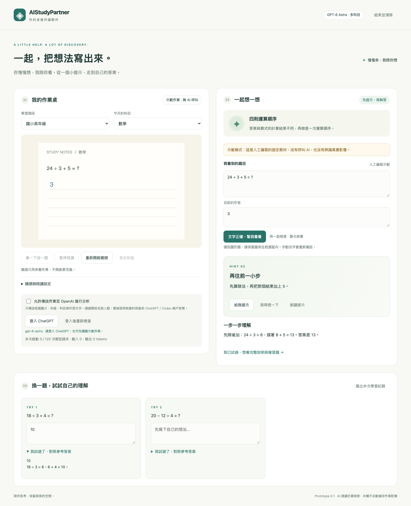

# AIStudyPartner｜AI 伴讀機器人

**Mac ＋ Webcam ＋ GPT-6 Astra：看作業、陪思考、給提示，再用複習題確認理解。**

鏡頭放在學生前上方，對準紙本作業。Mac 在本機篩選有變化的穩定畫面；GPT-6 Astra 讀題、解釋、提示與出複習題。支援年級切換及數學、國語、英文、自然、社會等科目。

## 登入方式：ChatGPT 網頁認證，沒有 API Key

點 **「登入 ChatGPT」** → 開啟官方認證網頁 → 完成登入 → 回到伴讀頁面。

本專案透過官方 **Codex App Server** 使用 ChatGPT 登入與 GPT-6 Astra，不直接呼叫 OpenAI Platform API，不要求 API Key，也不擷取 ChatGPT 網頁 Cookie。這使用 ChatGPT／Codex 方案額度，模型權限與速率依帳戶為準。

> **狀態：v0.1 可執行原型。** 已完成本機 Codex 握手、未登入狀態查詢及官方 OAuth 登入網址產生驗證；尚未完成本專案的真人 OAuth 登入、Astra 真實推理、實體 webcam／手寫作業與中文語音驗收。[驗證詳情](docs/VALIDATION.md)



## 專案規劃

- [產品規劃與多科目教學](docs/PRODUCT_PLAN.md)
- [系統架構與資料流程](docs/ARCHITECTURE.md)
- [開發階段與工作清單](docs/ROADMAP.md)
- [Mac 安裝、登入與操作](docs/MAC_SETUP.md)
- [資料與隱私](docs/PRIVACY.md)
- [方案額度與延遲規劃](docs/COST_AND_LATENCY.md)
- [測試報告與實機驗收](docs/VALIDATION.md)

## 快速啟動

安裝 [uv](https://docs.astral.sh/uv/getting-started/installation/) 及 [Codex](https://learn.chatgpt.com/docs/cli)。已有 Codex／ChatGPT 桌面版時，程式也會尋找內附的 Codex 執行檔。

```bash
git clone https://github.com/pcpcchen-coder/AIStudyPartner.git
cd AIStudyPartner
bash scripts/start.sh
```

開啟 **http://127.0.0.1:8765**。macOS 也可雙擊 `Start.command`。示範模式不需登入、不會呼叫模型；執行應用程式不需要 Node、Xcode 或 Docker。

### 真實作業陪讀

1. 按「登入 ChatGPT」，在官方網站登入；回到頁面按「登入後重新檢查」。
2. 選年級／科目、開啟鏡頭，框選**一題＋作答＋必要圖表**，避開姓名和人臉。
3. 勾選「允許傳送作業至 OpenAI 進行分析」。這才啟用雲端看題。
4. 核對辨識結果，必要時改字；按「文字正確，幫我看看」。
5. 先看提示，需要時再看完整解釋與複習題。「我再想一下」延後提醒兩分鐘。
6. 結束可主動匯出不含圖片的 JSON 紀錄；「結束並清除」停止鏡頭與清除本次學習狀態。

登入由本專案獨立的 `.runtime/codex-home` 管理，不借用或改寫你平常 Codex 的登入與設定。登出伴讀帳號也不登出日常 Codex。認證儲存由官方 Codex 的 OS keyring／本機 auth 機制處理，**不要分享 `.runtime/`**。

`.env` 僅供選用設定，無任何金鑰：

```dotenv
STUDY_MODEL=gpt-6-astra
STUDY_MAX_CALLS=120
```

## 已實作

- 攝影機選擇、左右／上下翻轉、還原方向、ROI 框選；預覽、截圖與停筆偵測方向一致，JPEG 長邊最多 1600 px。
- 0.5 秒本機取樣，穩定 2 秒再看題，15／30／60 秒最短間隔，跳過無變化畫面。
- 20／30／60 秒停筆提醒、60 秒冷卻及兩分鐘延後；現階段為畫面活動估計，尚非筆尖追蹤。
- GPT-6 Astra 讀題、結構化教學、兩層提示、完整解釋、1–3 題複習。
- 可更正辨識文字；未確認或不確定不判正誤。純四則式使用有理數核算，其他標示 AI 建議。
- Mac 已安裝的本機中文語音；不自動切成雲端語音。
- 單一併發、每次啟動最多 120 次模型請求、用量顯示、錯誤停止自動呼叫。
- 六科人工示範，與真實 AI 結果明確區分。
- OAuth 瀏覽器登入、狀態檢查、專案帳號登出；無 API Key fallback。

## 尚未完成

真實模型與手寫品質驗收、可靠的全頁自動追題、筆尖追蹤、透視校正、跨日個人化記憶、間隔複習排程、課綱知識庫、語音問答、原生安裝包、家長儀表板。年級選項會影響 prompt，但尚無逐年級驗證資料集。複習題目前由學生自行對照參考答案，不自動評分。

## 開發與測試

```bash
uv sync --frozen --python 3.12
uv run ruff check .
uv run pytest -q
npm ci
npm test
npx playwright install chromium
npx playwright test
```

測試使用合成圖、固定教材及模擬 Codex 協定，不需登入或消耗方案額度。正式啟用前依[驗收表](docs/VALIDATION.md)完成真實測試。

## 官方依據

[Codex 瀏覽器登入](https://learn.chatgpt.com/docs/auth) · [App Server 整合與 OAuth](https://learn.chatgpt.com/docs/app-server) · [GPT-6 Astra 能力](https://developers.openai.com/api/docs/models/gpt-6-astra)

查核日期：2026-09-23。使用者方案、模型可用性與資料政策仍以實際帳號為準。
