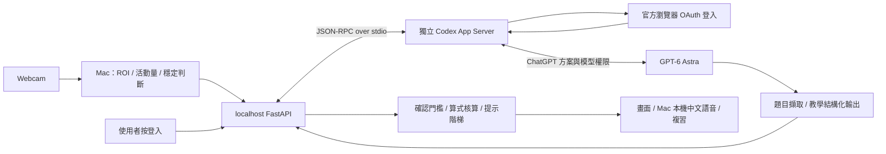

# 架構｜Mac 感測 + ChatGPT OAuth + Astra 教學

## 1. 身份與模型執行

這是 **Codex 官方登入及執行整合**，不是讓 ChatGPT OAuth token 代替 OpenAI Platform API Key。程式沒有直接對 `api.openai.com/v1/responses` 發送請求，沒有 API Key 路徑。

`codex_bridge.py` 啟動 `codex app-server --listen stdio://`，先 `initialize`，再 `initialized`。選用執行檔由 `STUDY_CODEX_BIN`、PATH 或桌面版 canonical 路徑找到。

認證流程：`account/login/start {type: chatgpt}` → 官方 `authUrl` → 瀏覽器登入 → 官方 localhost callback → `account/read`。前端只接收登入網址、是否登入及方案類型，不接收 access／refresh token、email 或密碼。URL 只允許 HTTPS 的 `auth.openai.com` 與 `chatgpt.com`。

獨立 runtime 位於 Repo 的 `.runtime/`，權限 0700；不使用日常 Codex 的登入快取、不複製認證檔。Codex 可將憑證存至 OS keyring，或回退專案 auth 檔。後端只呼叫官方登入／登出 RPC，不自行解析憑證。

## 2. 限制模型權限

專案專用設定關閉 shell、unified exec、apps、plugins、hooks、memories、多代理、瀏覽器／電腦操作、影像產生、檔案影像工具及 host skill discovery。執行工作區不含其他使用者檔案。

每次推理建立 `ephemeral=true` 的獨立 thread，`sandbox=read-only`、`approvalPolicy=never`。Turn 仍明確設定 readOnly＋networkAccess=false（限制工具網路；模型自身的雲端連線仍需網路）。伺服器提出的工具／額外權限請求一律回拒絕，不對使用者裝置執行動作。

上述為多層限制，不宣稱是未經驗證的完整隔離沙箱。正式分發前，需針對實際 Codex 版本稽核可用工具並做惡意題面測試。第一版只供可信任的本機使用者，不可當成公開代跑服務。

## 3. 模型內容與協定

- 預設 `gpt-6-astra`，不暗中換模型。
- `thread/start` 以 baseInstructions/developerInstructions 設定伴讀角色。
- `turn/start` 傳入 text 與 image data URL，`outputSchema` 來自 Pydantic。
- 讀題 effort=low，教學 effort=medium。沒有直接使用 Responses API 的 store 或 pricing 設定。
- `item/completed` 取 final agentMessage，`turn/completed` 確認成功，`thread/tokenUsage/updated` 累計 token。
- 拒答／失敗／斷線／無有效 JSON／120 秒逾時均停止自動分析；不中途補成假結果。
- 結束後 interrupt（若仍執行）與 unsubscribe，清掉本地事件佇列。

讀題與教學分為兩次模型請求，便於更正辨識文字。教學再次附上裁切圖以保留幾何、表格等資訊；相同題目不同提示層級使用有限快取。

## 4. 本機狀態與節流

| 設定 | 預設 | 邊界 |
|---|---|---|
| 本機取樣 | 500 ms | ROI 縮至 64×48 灰階 |
| 動作門檻 | 平均正規化差 >0.018 | 非筆尖追蹤、須實拍調校 |
| 重送門檻 | 與上次送出差 >0.012 | 光影可能誤觸發，小筆畫可能漏掉 |
| 穩定時間 | 2 秒 | 動作後重設 |
| 分析間隔 | 30 秒 | 可選 15／30／60 |
| 停筆時間 | 30 秒 | 可選 20／30／60 |
| 提醒冷卻 | 60 秒 | 第一次依停筆門檻觸發 |
| 延後提醒 | 120 秒 | 主動求助仍可用 |

generation 編號與 AbortController 防止過期回應覆蓋新題。換年級、科目、範圍、編輯文字、暫停與清除會使舊請求失效。已讀取圖與新畫面差異過大會重新讀題。取消瀏覽器 fetch 不保證已提交的模型推理已停止或不計入額度。

## 5. 本機端點

所有 `/api/` 都是本機前後端通訊，不是 OpenAI Platform API。

| 端點 | 用途 |
|---|---|
| GET `/api/config` | CSRF token、登入狀態、模型及本次用量 |
| POST `/api/auth/login` | 官方 ChatGPT OAuth 登入網址 |
| POST `/api/auth/logout` | 登出本專案帳號、清快取 |
| GET `/api/demo/{subject}` | 固定人工教材 |
| POST `/api/observe` | 裁切圖正規化、模型讀題 |
| POST `/api/tutor` | 教學、提示階梯與核算 |
| POST `/api/clear` | 清教學快取；保留登入 |

只監聽 loopback，TrustedHost、同來源限制、CSRF token、body 4.1 MB 上限與 `no-store`。真實分析另需雲端傳送開關。單一推理鎖，不排無限佇列。預設每次啟動最多 120 次模型嘗試，重啟會歸零，不是訂閱配額本身。

## 6. 資料生命週期與判讀

App 不自動儲存影像；JPEG 正規化去掉 metadata。Codex thread 使用 ephemeral，history persistence=none。這不等於雲端零保留，Codex runtime 也可能有診斷／認證 metadata，見 [PRIVACY](PRIVACY.md)。

教學快取只存雜湊與教學結果，最多 16 題，15 分鐘邏輯 TTL，下一次教學請求清過期項目；閒置時不保證即刻抹除記憶體。清除或服務終止時移除，舊在途請求不能重新填回快取。

未確認文字或教學模型自評低於 0.85 時不判正誤；0.85 未經校準。只有純四則字串可使用 AST 白名單＋Fraction 精確核算，不使用 eval。核算不證明模型的教學文字、複習題或幾何推導一定正確。

官方依據：[App Server](https://learn.chatgpt.com/docs/app-server)、[Auth](https://learn.chatgpt.com/docs/auth)。本機協定實際檢查版本：0.155.0-alpha.16.3；支援舊版本不予假設。
